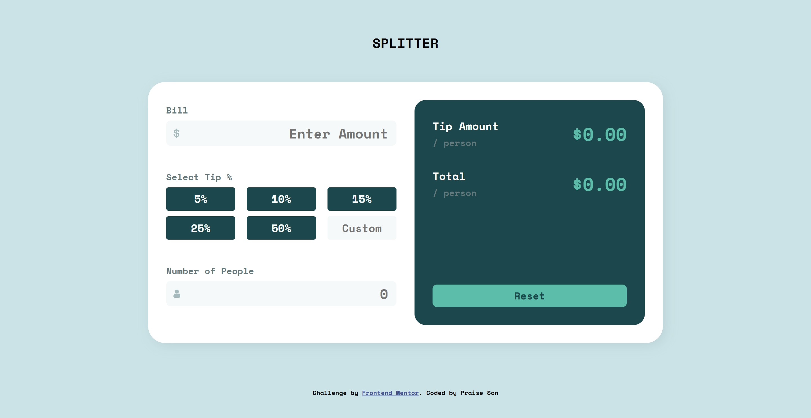
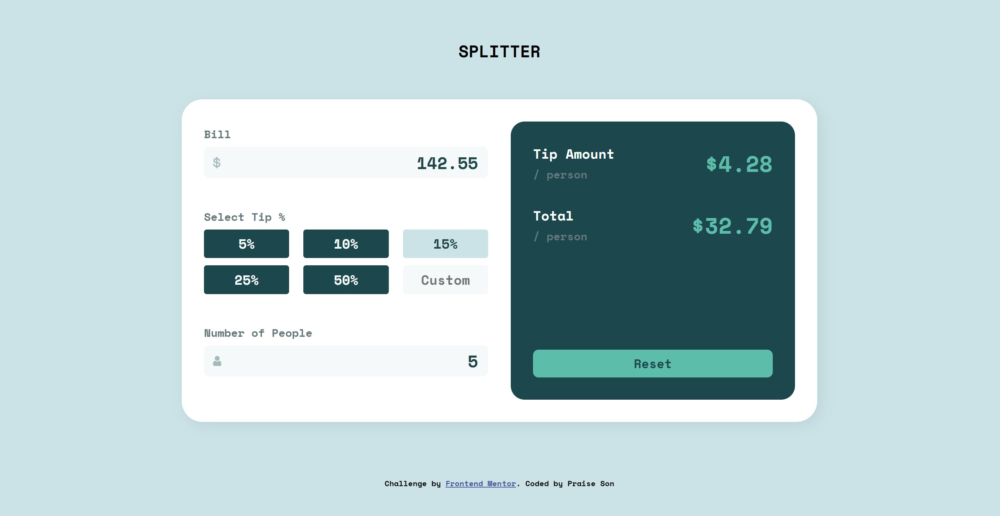
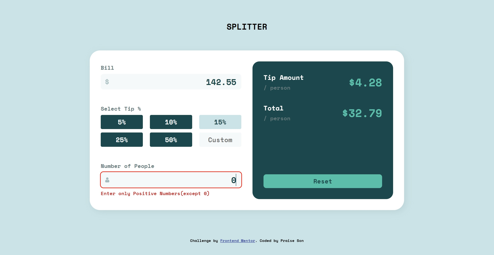
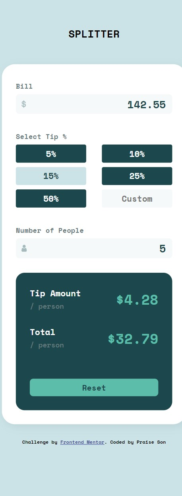

# Frontend Mentor - Tip calculator app solution

This is a solution to the [Tip calculator app challenge on Frontend Mentor](https://www.frontendmentor.io/challenges/tip-calculator-app-ugJNGbJUX). Frontend Mentor challenges help you improve your coding skills by building realistic projects.

## Table of contents

- [Overview](#overview)
  - [Screenshot](#screenshot)
  - [Links](#links)
- [My process](#my-process)
  - [Built with](#built-with)
  - [What I learned](#what-i-learned)
 
- [Author](#author)

### Screenshot
  ## Desktop 
  
  
  
  ## Mobile
  

### Links

- Solution URL: [Add solution URL here](https://github.com/Praiseson6065/tip-calculator-app-main)
- Live Site URL: [Add live site URL here](https://praiseson6065.github.io/tip-calculator-app-main/)

### Built with

- Semantic HTML5 markup
- CSS (Outline)
- Flexbox
- CSS Grid
- Js (Functions , Event Listeners,if  & for Loops)

### What I learned

- JS Event Listeners of Click & Input Type
- Grid 

## Author
- Frontend Mentor - [Praiseson6065](https://www.frontendmentor.io/profile/Praiseson6065)
- Linkedin - [Praiseson Yanamadala](https://www.linkedin.com/in/praiseson-yanamadala-606613220/)

